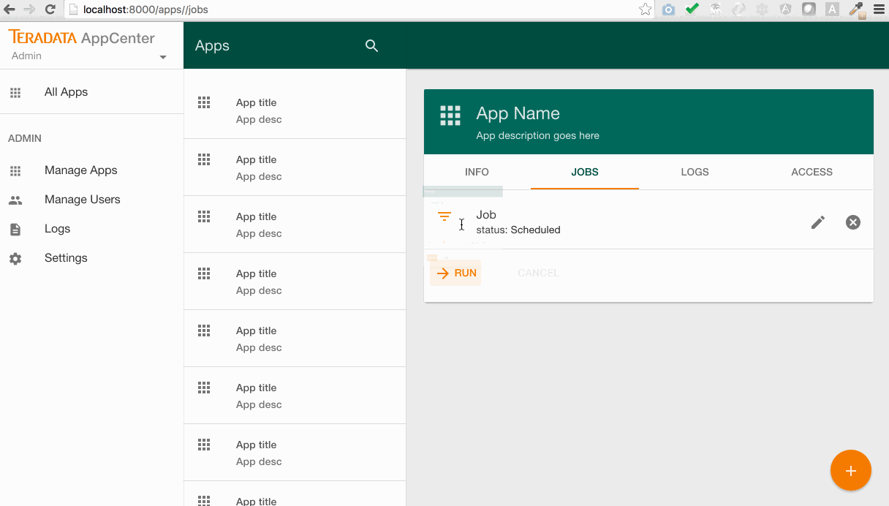
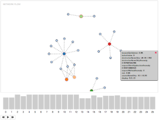
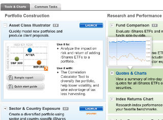
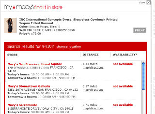

## Professional Experience
Founder of zElement (Data Visualization Web Application) and skyPatrol (Pebble Smartwatch App), hands-on Manager/Director, UI Architect with solid technical (MEAN and LAMP stacks), operations and product development experience in Agile environment. 

My Tech Stach: Angular.js, Backbone.js, Knockout.js, Require.js, d3.js, Handlebars.js, Haml, Jade,  jQuery, Pebble.js, YUI, Dojo, Underscore.js, Node.js, Phantom.js, Bootstrap, Material Design, JSON, XML, HTML5, CSS3, APIs, AJAX, Socket.IO, PHP, JSP, XSS, Spring, Struts, VMware, XSLT, Java, Rails environments, r.js, Grunt.js, Gulp, Bower, Jenkins, MongoDB, mySQL, responsive design, Maven, Jenkins, Karma, Jasmin, Git, Git Gerrit, Docker.

## Projects

### Stanford VPTL: HST project (7/2016 - 2/2017)

At Stanford VPTL group my responsibility was to architect and build Front End for the educational web application that allows professors to create and manage exams. The application is heavily focused on high level user interactions with web interface.
It allows to:
* Authenticate user with roles
* Create new exams 
* Load and edit exisisting exams
* Perform searches with filtering and sorting
* Upload and Remove media files
* Smart auto scroll based on states
* Auto save documents in Edit mode
* Validate data
* Supports Security
* Built with Performance in mind
* Supports Responsive Design
* Supports Assesibility

##### Tech Stack:
* Angular 1.5 with Require.js
* Angular Bootstrap UI
* REST and Data Structures
* HTML5
* CSS2
* Java
* SQL DB
* Maven
* Jenkins

### Teradata: App Center 2.0 (3/2016 - 6/2016) 

The project involved building the next version of AppCenter dashboard with up-to-date UI and UX, better performance and richer features. Integrated Login Auth, LDAP Settings, JSON validation, Stepper and other modules.

##### Tech Stack: 
* Angular 2.0
* Angular Material Design
* Angular-Formly: Material Templates
* Data Structures
* RESTful API communications
* Java
* Node.js
* Docker Containers

### Cisco Intercloud: AMP (Account Management Portal) (1/2015 - 10/2015)

This portal was built to allow CISCO Cloud users to have a consistent flow and seamless experience of interacting with various external CISCO systems.

The project involved a complete UI Architecture of the large scale application, integration with external and internal system components, RESTful API, security, authentication, SSO support, permissions, cross system communication, performance optimization, responsive design and more.

##### Tech Stack: 
* Angular.js + Require.js
* Data Structures
* Java
* Node.js
* REST APIs
* CSS3
* Bootstrap
* JavaScript
* jQuery
* r.js
* HTML5
* redhat
* Maven
* Jenkins

### skyPatrol: Pebble Smartwatch App (9/2014 - 2/2017)

skyPatrol displays real-time information of airplanes in the sky, based on user location.

The app is built for smart watch Pebble. When user selects a button to load the info, a request to the API end point is made. The response is a JSON based object that returns data and renders on the screen of the watch.

##### Tech Stack:
* PHP API 
* external API
* JSON
* Pebble.js
* Pebble location
* Pebble Ajax

### Monster Cable Products: Mobile Site (7/2014 - 9/2014)

Converted and refactored site's code to support mobile viewing experience and functionality. The site dynamically adjusts to various mobile devices, including iPhone, iPad and Android.

Enhanced functionality and layout of various components including navigation, supporting pages navigation, product main pages, main Responsive Design for main story page (http://www.monsterproducts.com/head-monster-story).

##### Tech Stack: 
* CSS3 with animations and media queries
* JavaScript
* jQuery plug-ins
* Bootstrap Mobile
* .Net

### e8Security: Data Visualization (3/2014 - 5/2017)

Botnet Cluster Visualization Prototype is a proof of concept for visualizing security intelegence data. The graph communicates a scenario where a source IP/domain sends data to destination IP/domain at a particular time period. The feature is built around asynchronous client-server communications utilizing RESful API services, data transformation and custom formatting to feed and render the graph, as well as real-time rich interactions.

##### Tech Stack:
* d3.js
* Data Structures
* Node.js
* Angular.js
* Backbone.js
* Require.js
* Handlebars
* Javascript + jQuery.js
* CSS
* HTML5
* Bootstrap

### AT&T: AIR BI Tool (5/2011 - 10/2013)

AT&T’s project AIR entailed building a Business Intelegence Tool for advertisement reporting and analytics. The tool pulled daily Big Data reports (TV, Cell phone, web), rendering in dynamic Data Visualization modules and thus allowing to interact and make scientific inferences, forecasts and computations.

##### Tech Stack: 
* d3.js
* JavaScript, jQuery
* Data Structures
* Backbone.js with Require.js
* Node.js, Phantom.js
* HTML5
* CSS3

### Walmart: Vudu, Pharmacy projects (04/2010 - 05/2011)

Walmart’s Vudu Video Service required client-side code optimization to enhance performance and transition from YUI to jQuery library support.

Pharmacy project’s objective was to redesign the module, enhance user experience and support new features. Asynchronous client-server content exhange leveraged via JavaScript, jQuery and JSON as well as re-architecture of global components have improved overall site performance and thus user experience.

##### Tech Stack: 
* YUI
* jQuery
* JavaScript
* Data Structures
* HTML5
* CSS3

### eBay: shopping.com projects (7/2009 - 5/2010)

"Guides" feature, composed of individual widgets, allowed users to create, edit and publish their own customized rich content pages to the web and be searchable by search engines. The widgets were: "Product" with Ajax + JSON driven "Mini Search" component, "Image Upload", "WZWG Text Editor", "Embeded Video Upload". Implemented lazy loading, dynamic DOM manipulation, drag and drop, Ajax-based pagination, dynamic interactions and efficient Object Oriented JavaScript code.
"Whislist" was introduced as one of the first e-commerce widgets that became popular with other e-commerce sites.

##### Tech Stack: 
* JavaScript
* jQuery
* jQuery plug-ins
* Data Structures
* HTML5
* CSS3

### BARCLAYS GLOBAL INVESTORS: Tools, Internationalization Mexico (6/2008 - 6/2009)

Project "Tools" was released in Q-3 of 2009. The objective was to introduce a new, easy and highly interactive experience for users to preview their financial analysis data summary.

Lazy loading concept allowed smart and fast on-demand data loading, thus allowing significantly faster performance on the Front End. Data Visualization allowed dynamic rendering and interaction of charts. Implemented system internationalization to serve Latin America.

##### Tech Stack: 
* JavaScript
* jQplot.js
* HTML
* CSS3

### Macy's (3/2007 - 5/2008)

A highly desired feature, "Find It In Store", was launched on macy's site to provide users with convenient experience of checking a product’s in-store availability in a near-by macy's store location. It enabled users with an easy, fun and convenient online shopping experience by allowing them in real-time to check whether an item is available, draw directions to the closest macy’s store and print out the map and the barcode.

YUI libraries, MapQuest API intergration, Ajax with JSON formated data, CSS were the main technologies and implementations used to develop this wizard-like flow.

##### Tech Stack: 
* YUI
* JavaScript
* MapQuest API
* XML
* HTML
* CSS3
